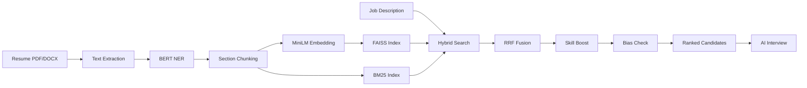

# 🤖 AI/ML Features — HireFlow AI

## Overview

HireFlow AI uses a multi-layer AI/ML pipeline for intelligent resume processing, candidate matching, fairness-aware ranking, and AI-powered interviewing.

---

## Pipeline Architecture

```
Resume Upload → Parse → NER → Chunk → Embed → Index → Search → Rank → Interview
```



---

## Layer 1: Resume Parsing

**File:** `app/core/parsing.py`

- Extracts raw text from PDF files using **PyMuPDF (fitz)**
- Extracts raw text from DOCX files using **python-docx**
- Handles multi-page documents and preserves structure

---

## Layer 2: Named Entity Recognition (NER)

**File:** `app/core/ner.py`  
**Model:** `dslim/bert-base-NER` (BERT-based token classifier)

Extracts domain-specific entities from resume text:

| Entity Type | Examples |
|---|---|
| **SKILL** | Python, React, Docker, Machine Learning |
| **JOB_TITLE** | Senior Developer, Data Scientist |
| **COMPANY** | Google, Microsoft (via ORG label) |
| **EDUCATION** | B.Tech, IIT, Stanford |
| **LOCATION** | Bangalore, New York (via LOC label) |
| **DATE** | Jan 2020 – Present, 2018–2022 |

**How it works:**
1. Text is split into 450-char chunks (BERT token limit)
2. BERT NER runs on each chunk with `aggregation_strategy="simple"`
3. Raw NER labels (PER, ORG, LOC, MISC) are mapped to domain types using keyword dictionaries
4. Dates are additionally extracted via regex patterns
5. Skills are also matched against a curated keyword set of 80+ tech skills

---

## Layer 3: Section Chunking

**File:** `app/core/chunking.py`

Splits resume text into semantic sections:
- **skills_chunk** — Extracted skills and technical abilities
- **experience_chunk** — Work experience and job history
- **education_chunk** — Education and certifications
- **summary_chunk** — Profile summary or objective
- **full_chunk** — Complete resume text

Each chunk is stored separately for fine-grained retrieval.

---

## Layer 4: Sentence Embedding

**File:** `app/core/embedding.py`  
**Model:** `all-MiniLM-L6-v2` (Sentence-Transformers)

- Generates **384-dimensional** normalized vectors
- Each resume chunk is embedded independently
- Embeddings are L2-normalized for cosine similarity via inner product
- Supports batch encoding with `batch_size=32`

---

## Layer 5: Vector Indexing (FAISS)

**File:** `app/core/index.py`  
**Library:** `faiss-cpu`

- Uses `IndexFlatIP` (Inner Product) — equivalent to **cosine similarity** on normalized vectors
- Vectors are stored persistently in `hireflow.index`
- Metadata (candidate_id, chunk_type, chunk_text) stored in SQLite `faiss_metadata` table
- Supports incremental addition of new vectors

---

## Layer 6: Hybrid Search

**File:** `app/core/search.py`

Combines two retrieval strategies:

### Dense Search (Semantic)
- Query text is embedded with MiniLM
- FAISS inner product search finds semantically similar candidates
- Captures meaning even with different wording

### Sparse Search (Keyword)
- **BM25Okapi** (Okapi Best Matching 25) algorithm
- Tokenized keyword matching on chunk texts
- Excels at exact keyword matches

### Reciprocal Rank Fusion (RRF)
Both result sets are fused using RRF with `k=60`:

```
RRF_score(candidate) = Σ 1 / (k + rank_i)
```

Where `rank_i` is the candidate's rank in each retrieval method. This produces a single unified ranking that leverages both semantic understanding and keyword precision.

---

## Layer 7: Skill Boost Ranking

**File:** `app/core/ranking.py` → `apply_skill_boost()`

Applies a multiplicative boost based on BERT-extracted skill overlap:

```
boost = 1.0 + (0.1 × skill_overlap_count) + (0.05 × mean_aptitude)
final_score = rrf_score × boost
```

- **skill_overlap_count**: Number of candidate skills matching the job description
- **mean_aptitude**: Average aptitude score for matched skills
- Candidates are re-ranked by `final_score`

---

## Layer 8: Fairness & Bias Checking

**File:** `app/core/ranking.py` → `bias_check()`

Ensures ethical AI-driven hiring:

| Check | Description |
|---|---|
| **Location excluded** | Geographic location is never used in scoring |
| **Company excluded** | Previous employer names don't affect ranking |
| **Skills-only boost** | Only SKILL and JOB_TITLE entities feed the boost calculation |
| **Education clustering** | Warns if 8+/10 top candidates share the same institution |
| **Explainability** | Per-candidate breakdown of scoring components |

Each search result includes a **fairness report** with:
- Which skills were used in scoring
- RRF score before/after boost
- Dense vs sparse component scores
- Confirmation that location/company were excluded

---

## Layer 9: AI Interview

**File:** `app/core/interview.py`  
**Model:** OpenAI GPT / Google Gemini API

- LLM generates contextual interview questions based on:
  - Candidate's extracted skills
  - Job description requirements
  - Previous conversation context
- Multi-turn conversational interview
- Automatic scoring across categories upon completion
- Results include per-category scores and overall assessment

---

## Layer 10: Upskilling & Career Pathing

**File:** `app/routes/upskilling.py`  
**Model:** OpenAI / Gemini / Automated Course Synthesis

HireFlow AI provides personalized learning paths to help candidates bridge skill gaps:

- **Skill Gap Discovery**: Compares candidate's extracted skills against requirements of any job role.
- **Contextual Synthesis**: Uses LLMs to generate a curated learning path for specifically identified missing skills.
- **Provider Aggregation**: Recommends courses from Udemy, Coursera, YouTube, freeCodeCamp, edX, etc.
- **Adaptive Guidance**: Adapts suggestions based on the target job title and detected proficiency levels.

**Process:**
1. Candidate profile (Layer 2 & 3) is compared against target Job Schema.
2. Case-insensitive normalization identifies exact skill overlaps and missing entities.
3. LLM prompt engineered with "Career Coach" persona generates high-intent course metadata.
4. JSON-structured result provides titles, providers, levels, and direct learning links.

---

## Models Summary

| Model | Purpose | Dimensions | Source |
|---|---|---|---|
| `dslim/bert-base-NER` | Named Entity Recognition | Token-level | HuggingFace |
| `all-MiniLM-L6-v2` | Sentence Embedding | 384-dim | Sentence-Transformers |
| FAISS `IndexFlatIP` | Vector Similarity Search | 384-dim | Meta AI |
| BM25Okapi | Keyword Search | Sparse | rank-bm25 |
| GPT / Gemini | Conversational Interview | — | OpenAI / Google |

---

## Startup Sequence

**File:** `app/services/ml_models.py`

```
1. Load BERT NER model (GPU → CPU fallback)
2. Load MiniLM embedding model (CUDA → CPU fallback)
3. Load/create FAISS index from disk
4. Rebuild BM25 index from database
5. Initialize LLM for interviews
```

All models are loaded once at server startup and reused for all requests.
