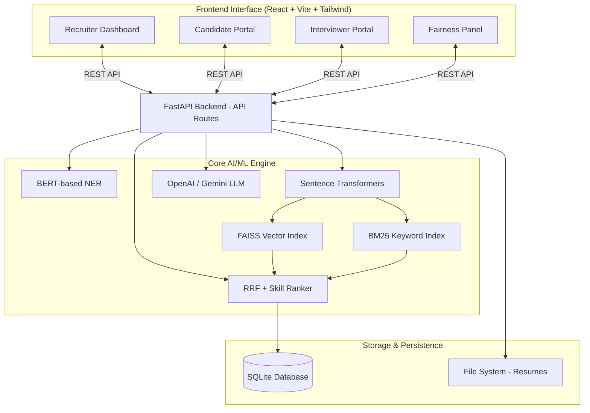
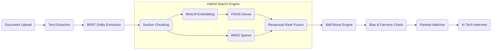

# 🚀 HireFlow AI: Architecture & System Overview

> **An AI-driven recruitment automation system** featuring hybrid search, advanced resume parsing, semantic skill matching, and conversational AI interviews.

---

## 🏗️ 1. High-Level System Architecture

HireFlow AI is built on a modern **client-server architecture**, heavily integrating NLP and ML models for intelligent candidate evaluation.

---

## ⚙️ 2. Technology Stack

A robust stack designed for speed, scalability, and state-of-the-art AI integration:

| Component | Technology | Description |
| :--- | :--- | :--- |
| **Frontend** | React, Vite, Tailwind CSS, Recharts | Interactive UI for recruiters, candidates, and interviewers. |
| **Backend API** | FastAPI, Python 3.11+ | High-performance async API server. |
| **Database** | SQLite, SQLAlchemy, FAISS | Relational data and dense vector approximations. |
| **NLP & ML** | HuggingFace, PyTorch, Sentence-Transformers | Core ML frameworks for embedding and entity extraction. |
| **GenAI** | OpenAI GPT / Google Gemini API | Conducts dynamic, multi-turn technical interviews. |

---

## 🧠 3. How It Works: The AI Pipeline

The system processes resumes and matches candidates through a sophisticated **9-layer pipeline**.

### 🔹 Layer Details

1. **Document Parsing**: Extracts text from PDFs (`PyMuPDF`) and DOCX (`python-docx`), preserving document structure.
2. **Named Entity Recognition (NER)**: Uses `dslim/bert-base-NER` to detect Skills, Job Titles, Companies, and Education.
3. **Chunking**: Splits parsed text into logical segments (Skills, Experience, Education, Summary) for fine-grained analysis.
4. **Vector Embedding**: Uses `all-MiniLM-L6-v2` to convert chunks into 384-dimensional dense vectors representing semantic meaning.
5. **Hybrid Search**: 
   - **Dense (FAISS)** matches conceptual meaning (e.g., "Fullstack Developer" matches "React/Node Engineer").
   - **Sparse (BM25)** ensures precise keyword matches.
6. **Reciprocal Rank Fusion (RRF)**: Merges dense and sparse ranks into a single unified score.
7. **Skill & Aptitude Boost**: Multiplies candidate scores based on how well their extracted skills overlap with the job description.
8. **Fairness Evaluation**: Strips out identifiers like Location or Company from the ranking algorithm and checks for biases (e.g., educational clustering).
9. **AI Interview**: Feeds candidate data to an LLM (GPT/Gemini) to conduct a personalized, interactive technical screening, scoring them question by question.

---

## 📊 4. System Advantages

- **Deep Semantic Understanding**: Goes beyond basic keyword searches; it understands context and synonyms using Sentence Transformers.
- **Ethical & Unbiased Hiring**: AI scoring runs through strict fairness checks that guarantee location-agnostic and employer-agnostic evaluations.
- **Explainable Ranking**: Recruiters don't just see a score; they see exactly _why_ a candidate scored highly (e.g., Skill Overlap: 80%, Semantic Match: 95%).
- **Interactive Vetting**: The AI Chatbot conducts pre-screenings that adapt dynamically based on the specific candidate's resume and the job's requirements.

---

_This architecture ensures high accuracy in matching while severely minimizing human and systemic biases in the hiring pipeline._
